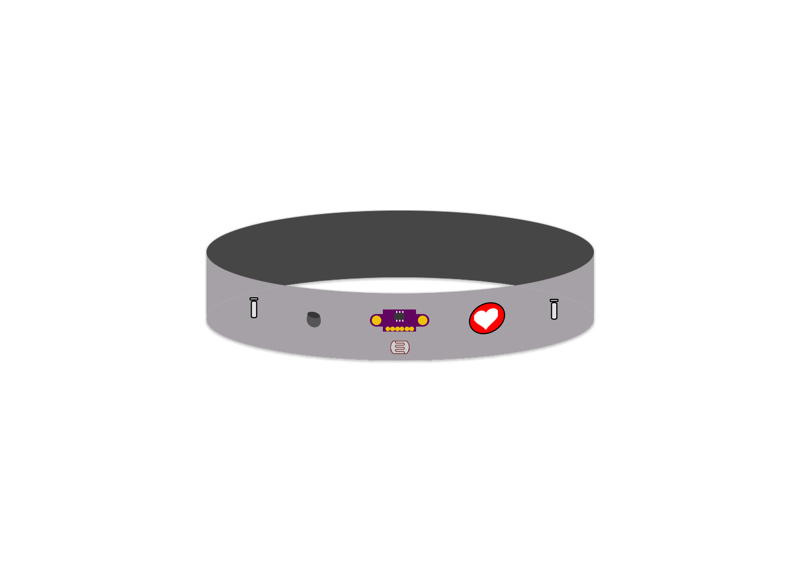
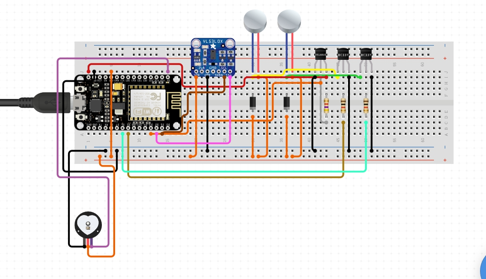

# MEDLIN

This is repository for medlin project. Using various Sensors to measure condition with ecg and temperature sensors, distance using lidar, light intensity with LDR. Sending the data through realtime DB streaming to make sure the plot and analysis of the data.

Here's our design of medlin headband

And here is the implemented demo of the headband and the sensors.

The software side are using 'electron js' which the documentationing can be seen at this [link](https://electronjs.org/docs/all)

Here are the 1st model of out gui apps.
***
###### nunggu bang jun
***
***
## How to run this project

After cloning this repository, and we assume that you already installed the right version of npm, just start
'''
npm start 
'''
***
## Features

Medlin has
..* BPM pulse sensor
..* Lidar sensor
..* LDR sensor
..* DS1820 (temperature sensor)
..* Vibration motor

In software side medlin use 'electron js' as the main framework because we want a GUI application. The software side are connected to vatious token from 'AWS machine learning' and  'firebase realtime database' 
***
## How it works

Medlin has various sensors and an actuator( BPM pulse sensor, Lidar sensor, LDR, Temperature DS1820 sensor, and vibration motor ). The data after the read in 'wemos d1 mini' are redirected to 'firebase' realtime database token. The database are connected through API from 'firebase' to the webpages where the analysis and plotting are running. The results will be stored at Database 
